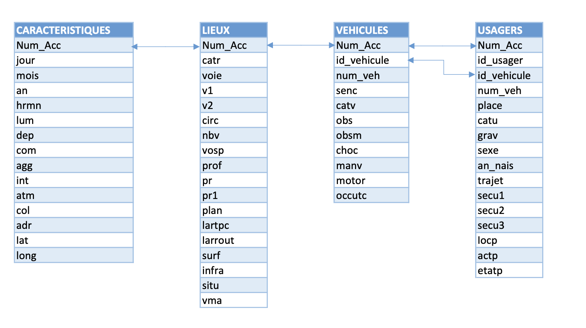

# Modeling the Injury Severity of Micro-Mobility Vehicle Riders 🛴🚲💥

This repository contains the code, data processing scripts, and materials related to the pre-print:

**"Modeling the injury severity of riders and pedestrians in micro-mobility vehicle crashes"**  
by Martin De Jaeghere and Silvia Varotto, 2025.

The repository allows you to reproduce the results of the study, adapt the analysis to other vehicles or cities, integrate newly released crash data, and refine model configurations.

---

## How to use the code
1. Clone this repository:
   ```bash
   git clone https://github.com/martin1207/modeling-mmv-severity.git
   cd modeling-mmv-severity

2. Create and activate a virtual environment (recommended):
   ```bash
    python -m venv mmv_severity_env
    source mmv_severity_env/bin/activate   # on Linux/Mac
    mmv_severity_env\Scripts\activate      # on Windows


3. Install dependencies:
    ```bash
    pip install -r requirements.txt
---
## Repository Structure

- [Data loading, wrangling and cleaning](loading_and_cleaning_data.ipynbt) # Create the dataset
- [tests](desc_stats_and_bivariate_test.ipynb) # desc stats and testing
- [Model development](modeling_development.ipynb) # Estimation of the models and conduction of the out-of-sample validation
- [requirements](requirements.txt)
- [README.md](README.md)


---
## Data explanation


The [dataset](https://www.data.gouv.fr/fr/datasets/bases-de-donnees-annuelles-des-accidents-corporels-de-la-circulation-routiere-annees-de-2005-a-2023/#/resources)) contains detailed information on traffic accidents (when, where, and under what conditions crashes occur), plus details on vehicles and people involved. 



The field explanation (English version) can be found in this file: [metadata](docs/accidents_metadata_en.md). (Original French version can be found in this [pdf](https://www.onisr.securite-routiere.gouv.fr/sites/default/files/2024-10/Description%20des%20bases%20de%20donn%C3%A9es%20annuelles.pdf))
